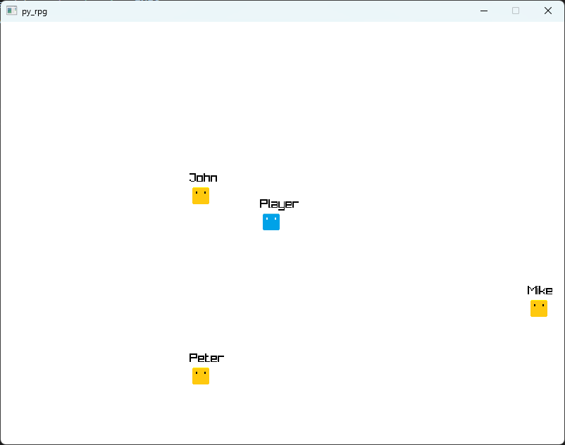

# py_rpg

`py_rpg` is an educational project with the goal of learning about game development
with `Raylib`, and having fun while doing it.

At its core `py_rpg` is emulating `Godot` by adopting a similar strategy in handling
game objects via scenes and nodes. This makes the development initially more focused
on the engine/core parts rather than a game.



This project uses `mypy` in strict mode for static type checking, and Python's `unittest`
module for unit tests.

## Setup

Set up a virtual environment in the workspace and install the required packages.

For example:
```
python -m venv venv
./venv/Scripts/activate
pip install -r requirements.txt
```

## Running the program

To run the program run `python py_rpg/main.py`

To start the program in debug mode use the `--debug` flag.
